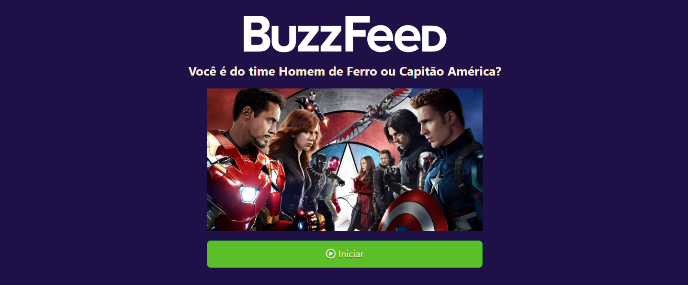

# <center>Avengers: Are you on the Iron Man or Captain America team?</center>

<p align="center">
   
</p>

<div align="center">

  **Deployed URL**
  </br>
  https://angular-buzzfeed-quizz-clone-six.vercel.app/
  </br>

  [Português](#pt) / [English](#en)

</div>


## 📝 Índice <a name = "pt"></a>

- [Sobre](#about_pt)
- [Linguagens e Ferramentas](#frameworks_pt)
- [Aprendizados](#learnings_pt)
- [Como executar localmente](#running_pt)

## 🎯 Sobre <a name = "about_pt"></a>

- Clone de um Quiz do BuzzFeed desenvolvido durante o bootcamp _Coding The Future Banco PAN - Desenvolvimento Frontend com Angular_ da [**DIO**](https://www.dio.me/), onde o objetivo foi usar a criatividade para aplicar os recursos aprendidos do Angular carregando dados de um arquivo JSON mockado.

## ⚒ Linguagens e Ferramentas <a name = "frameworks_pt"></a>

- [HTML](https://developer.mozilla.org/pt-BR/docs/Web/HTML)
- [CSS](https://developer.mozilla.org/pt-BR/docs/Web/CSS)
- [TypeScript](https://www.typescriptlang.org/pt)
- [Angular 14](https://v14.angular.io/docs)
- [Font Awesome Icon](https://fontawesome.com/search?o=r&m=free)

## 💡 Aprendizados <a name = "learnings_pt"></a>

- Hook de Ciclo de Vida: ngOnInit.
- Diretivas estruturais: *ngIf e *ngFor.
- Binding do evento de click com Angular.
- Injeção de Componentes.
- Configurações do tsconfig.json para uso do JSON mockado.
- CSS Responsivo.

## 🖥️ Como executar localmente <a name = "running_pt"></a>

Clone o projeto:

```
git clone https://github.com/bernard-silva/angular-buzzfeed-quizz-clone.git
```

Navegar até a raiz do projeto:

```
cd angular-buzzfeed-quizz-clone
```

Instale as dependências:

```
npm install
```

Inicie o servidor:

```
ng serve
```

Acesse a URL `http://localhost:4200/`

</br>

## English

## 📝 Index <a name = "en"></a>

- [About](#about_en)
- [Languages and Tools](#frameworks_en)
- [Learnings](#learnings_en)
- [How to run locally](#running_en)

## 🎯 About <a name = "about_en"></a>

- Clone of a BuzzFeed Quiz developed during the bootcamp _Coding The Future Banco PAN - Frontend Development with Angular_ from [**DIO**](https://www.dio.me/), where the objective was to use creativity to apply learned Angular features by loading data from a mock JSON file.

## ⚒ Languages and Tools <a name = "frameworks_en"></a>

- [HTML](https://developer.mozilla.org/en/docs/Web/HTML)
- [CSS](https://developer.mozilla.org/en/docs/Web/CSS)
- [TypeScript](https://www.typescriptlang.org/)
- [Angular 14](https://v14.angular.io/docs)
- [Font Awesome Icon](https://fontawesome.com/search?o=r&m=free)

## 💡 Learnings <a name = "learnings_en"></a>

- Lifecycle Hook: ngOnInit.
- Structural Directives: *ngIf and *ngFor.
- Binding Event on Angular: click.
- Component Injection.
- tsconfig.json settings for using mock JSON.
- Responsive CSS.

## 🖥️ How to run locally <a name = "running_en"></a>

Clone the project:

```
git clone https://github.com/bernard-silva/angular-buzzfeed-quizz-clone.git
```

Navigate to the project root:

```
cd angular-buzzfeed-quizz-clone
```

Install dependencies:

```
npm install
```

Start the server:

```
ng serve
```

Access the URL `http://localhost:4200/`
